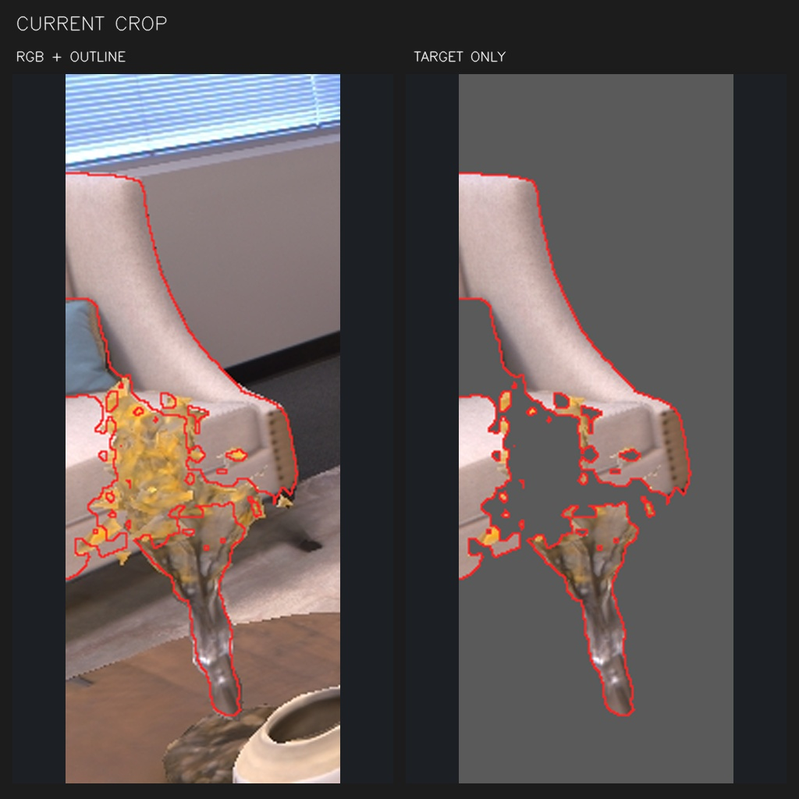
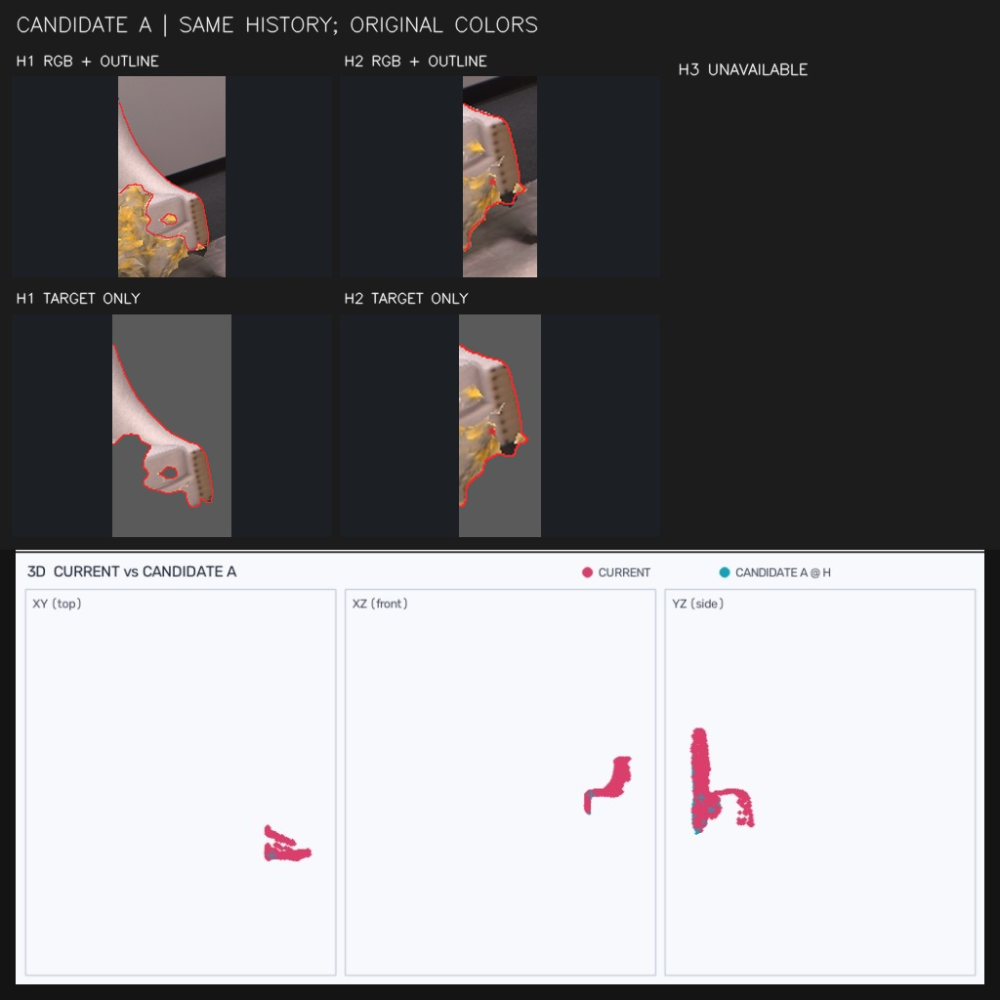
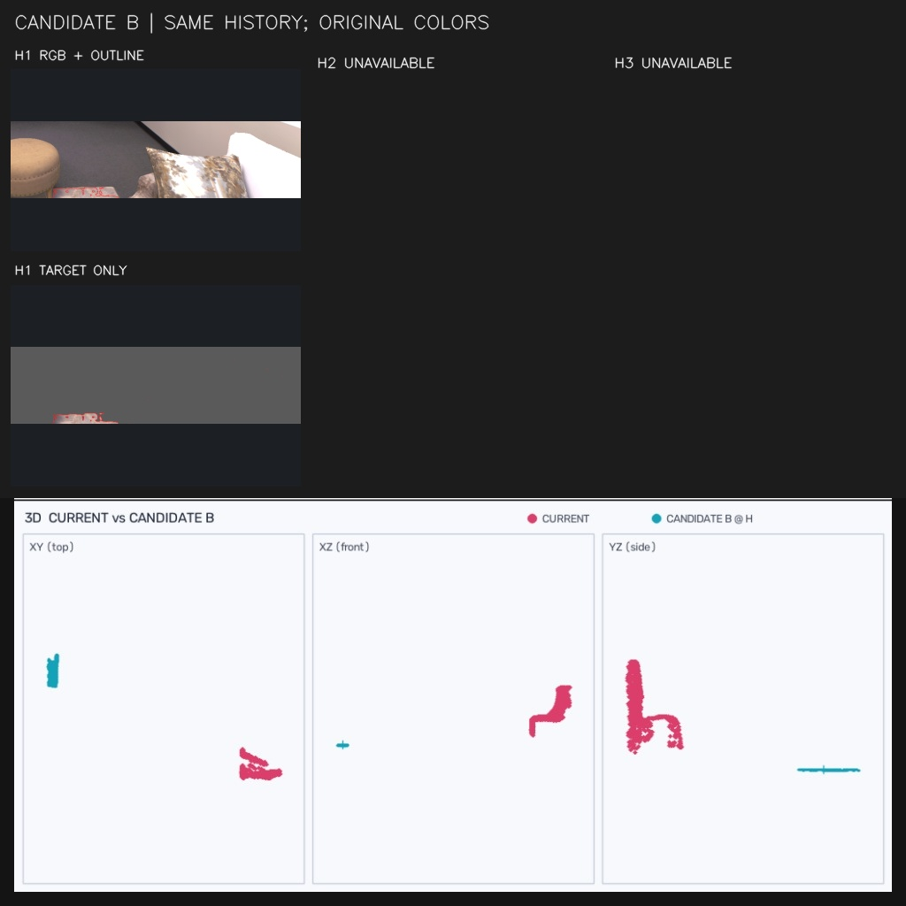
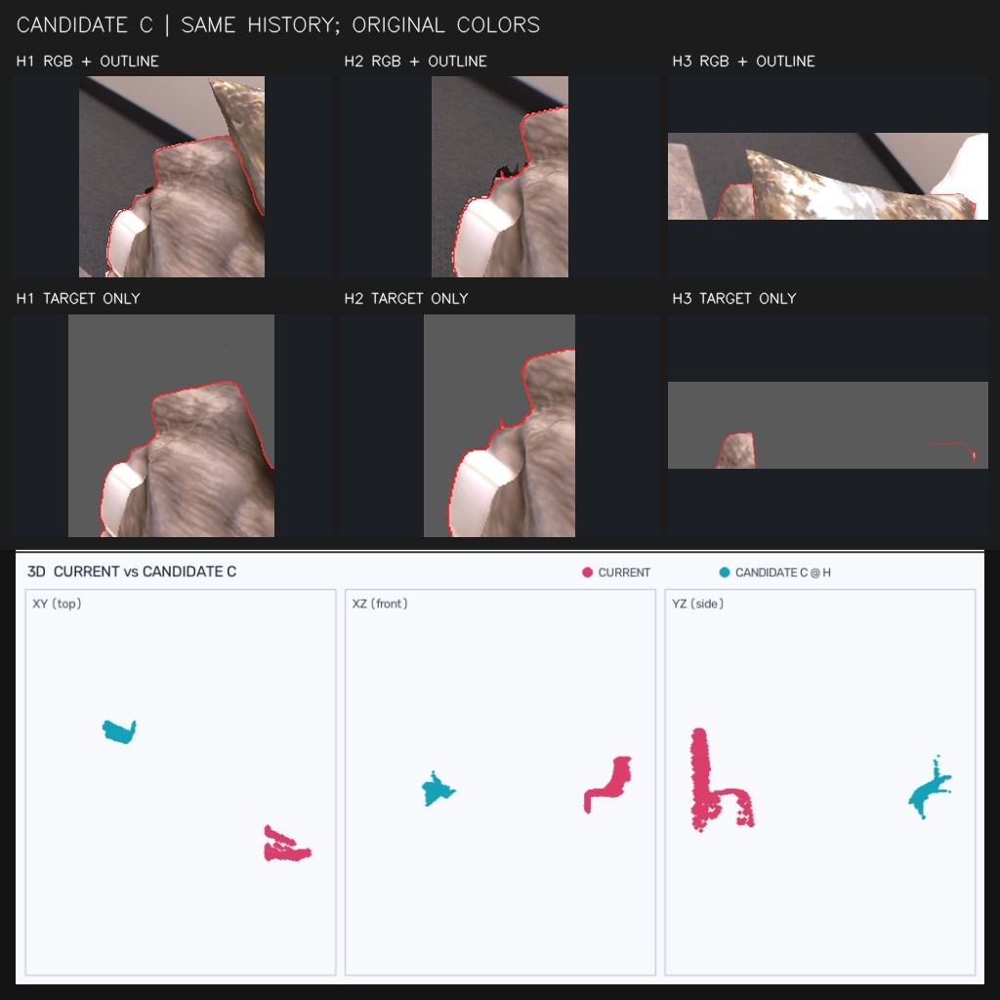

# f000124_d004_create

类型：create；帧：124；参考状态：已确认；参考选择：A。

[结构化案例与图序](case.json) · [原始 system 提示词](../../prompts/create_dd0ea6977cce.txt) · [返回索引](../../CASES.md)

## 1. CURRENT CONTEXT

## 2. CURRENT CROP

## 3. CANDIDATE A

## 4. CANDIDATE B

## 5. CANDIDATE C

