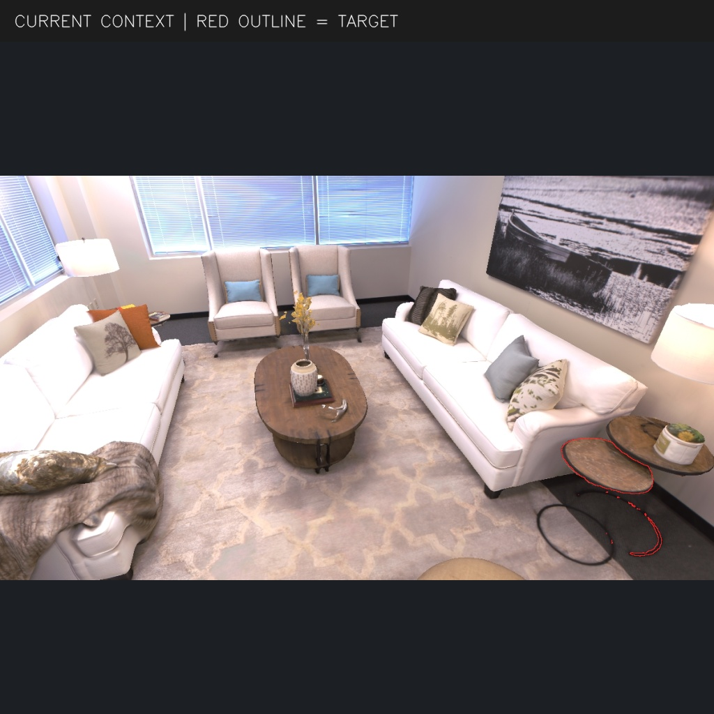
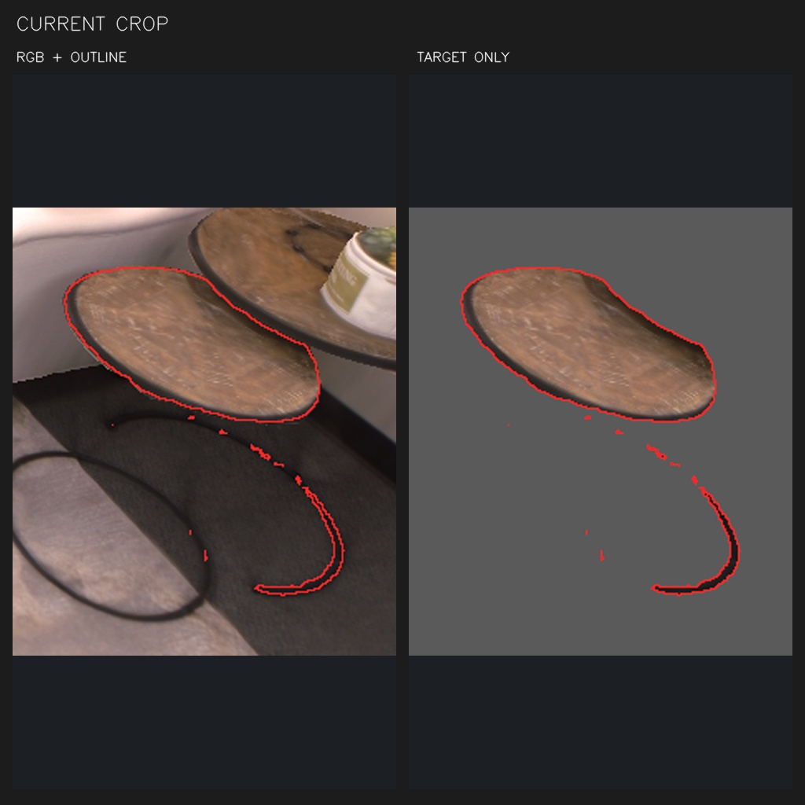
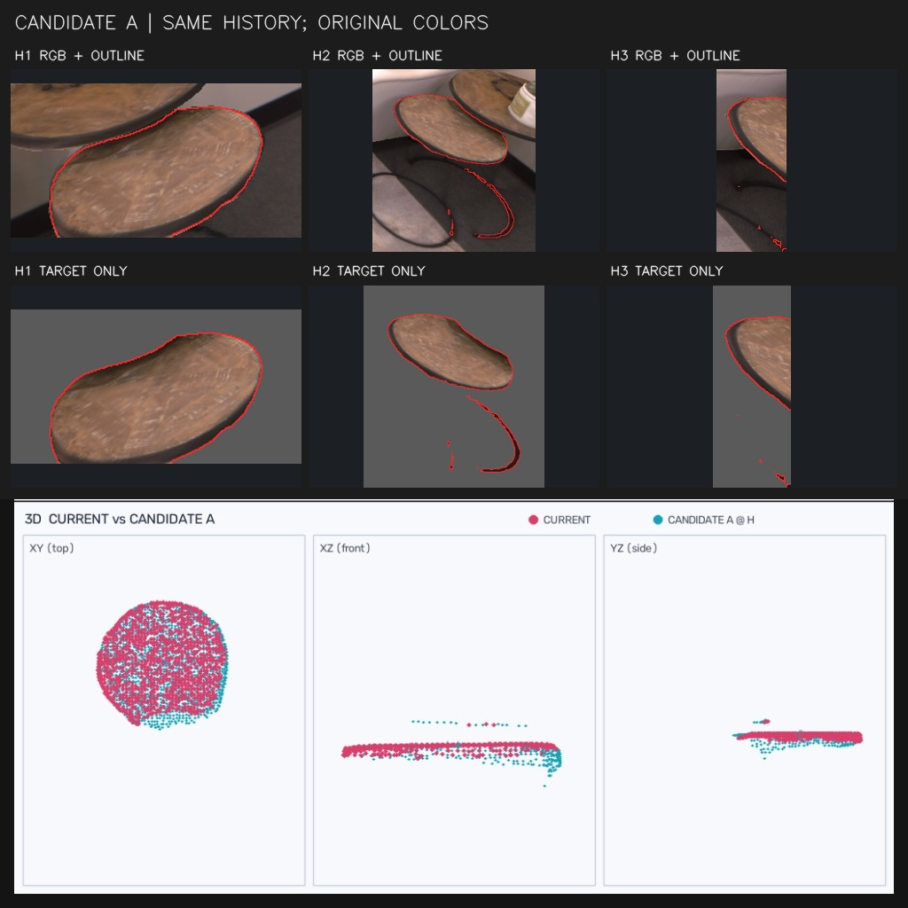
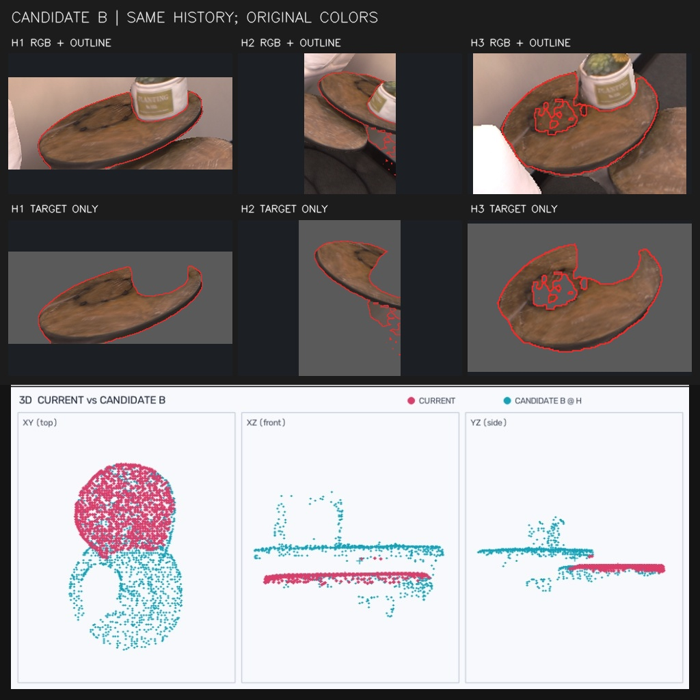

# f000333_d023_association

类型：association；帧：333；参考状态：历史参考；参考选择：A。

[结构化案例与图序](case.json) · [原始 system 提示词](../../prompts/association_251bc9007212.txt) · [返回索引](../../CASES.md)

## 1. CURRENT CONTEXT

## 2. CURRENT CROP

## 3. CANDIDATE A

## 4. CANDIDATE B

