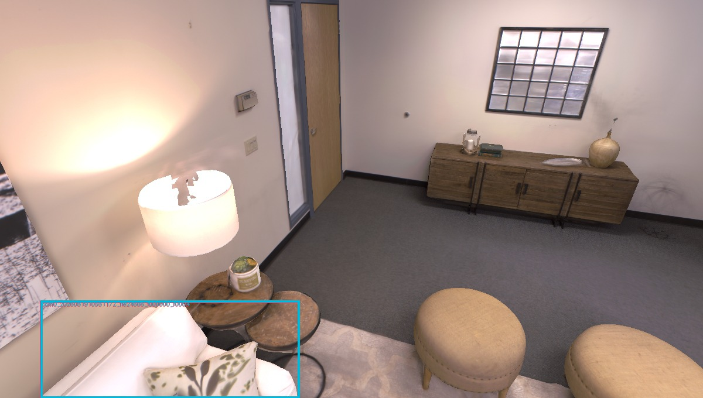
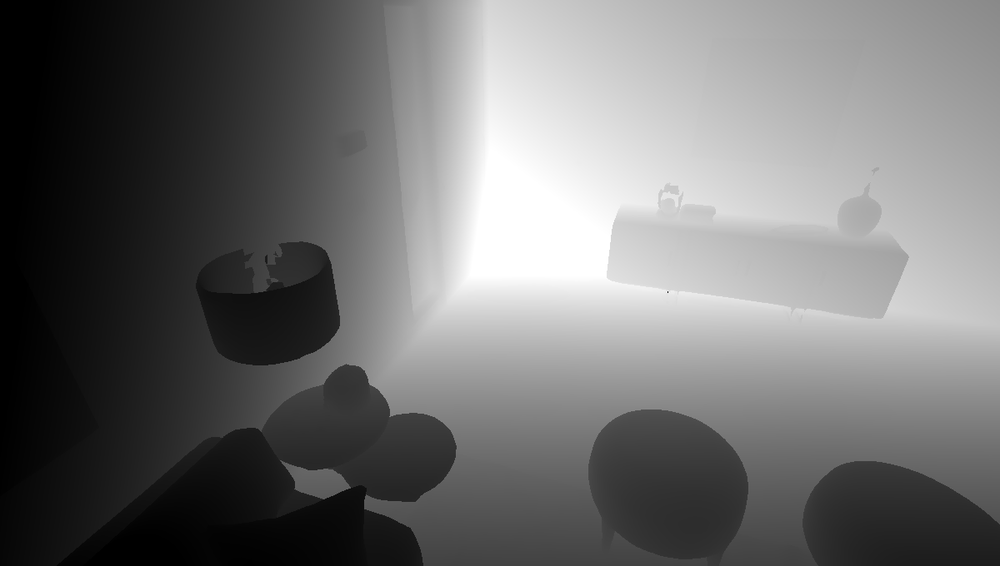
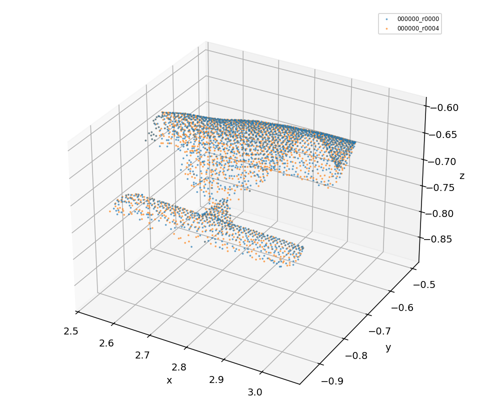

# `ali-my` 分层因果查错器 v1：证据与实测结果

本目录保存 2026-08-19 在 Replica `room0` 上实际生成、且适合直接放入 GitHub 查看的一组证据和审计产物。查错器全程只读，不执行 detach、merge、delete 或自动修图。

## 先看结论

| 项目 | room0 全量结果 |
|---|---:|
| Evidence Gate | `PASS` |
| 地图被修改 | 否 |
| 已确认系统错误 | 0 |
| Findings | 2455 |
| Root-cause candidates | 574 |
| `LIKELY_MAPPING_CONFLICT` | 502 |
| `AMBIGUOUS_MAPPING_RISK` | 1944 |
| `INSUFFICIENT_EVIDENCE` | 9 |
| 生成的 Evidence Packets | 200 |

2455 是规则筛出的风险候选，不是 2455 个已确认错误。`DET-001`、`SEG-004`、`ASSOC-003` 和 `ASSOC-004` 中部分计数达到单规则 500 条的输出上限，因此也不能把 500 当作完整发生量或错误率。

当前主要根因假设为上游重复 detection proposal：574 个根因候选中有 503 个归到 `duplicate_proposal`。需要对高优先级证据包进行人工标注后，才能报告各规则 precision。

## 在哪里看什么

### 1. 新 smoke 的结构化建图证据

目录：[structured_evidence_smoke](room0_20260819/structured_evidence_smoke/)

| 文件 | 内容 |
|---|---|
| `manifest.json` | run、配置、代码状态、输出哈希、审计 policy |
| `frames.jsonl` | frame UID、图像/深度、pose、intrinsics、观测计数 |
| `observations.jsonl` | raw/processed mask、深度分位数、DBSCAN 前后聚类、特征与点云引用 |
| `filter_trace.jsonl` | 每个过滤 gate 的真实值、阈值、运算符及首个失败原因 |
| `associations.jsonl` | CREATE/ASSOCIATE、Top-K、margin、候选版本、融合前后版本 |
| `mapping_events.jsonl` | CREATE、ASSOCIATE、DENOISE、FILTER、MERGE 的因果事件链 |
| `object_versions.jsonl` | 每个对象版本的成员、几何、类别、特征及 active 状态 |
| `object_pair_decisions.jsonl` | merge 候选指标、阈值、接受/拒绝和 source 消费状态 |
| `final_membership.json` | 最终对象到 observation 的唯一成员关系 |
| `evidence_summary.json` | 缺引用、重复成员和日志错误等汇总 |

这个 smoke 有 2 帧、70 个 raw observation、47 个 kept observation；47/47 都有深度与聚类统计，最终 19 个对象。证据缺失引用、重复成员和日志错误均为 0。

二进制 observation PCD、processed mask、特征矩阵和全部源快照仍保存在服务器实验目录，没有复制进 Git，以避免仓库膨胀；所有引用与 SHA-256 仍可从 manifest/ArtifactRef 追溯。

### 2. room0 全量结构化审计结果

目录：[full_audit](room0_20260819/full_audit/)

- [findings.jsonl](room0_20260819/full_audit/findings.jsonl)：2455 条逐案记录；包含 checker、实体、事实、假设、veto、缺失证据、certainty/severity、分流和优先级。
- [root_causes.jsonl](room0_20260819/full_audit/root_causes.jsonl)：574 个跨阶段根因候选及替代解释。
- [audit_summary.json](room0_20260819/full_audit/audit_summary.json)：分层、规则、确定性和分流统计。
- [evidence_validation.json](room0_20260819/full_audit/evidence_validation.json)：Evidence Gate 与系统层结果。
- [audit_config.yaml](room0_20260819/full_audit/audit_config.yaml)：本次真正生效的版本化阈值与 policy。
- [audit_manifest.json](room0_20260819/full_audit/audit_manifest.json)：输入/配置/输出哈希和只读声明。
- [mask_conflict_graph.jsonl](room0_20260819/full_audit/mask_conflict_graph.jsonl)：同帧 mask 冲突图。

### 3. 可视 Evidence Packet 示例

目录：[sample_case_finding_000002](room0_20260819/sample_case_finding_000002/)

这是一个 `DET-001 / DUPLICATE_PROPOSAL` 候选。实测：mask IoU `0.999928`、containment `1.0`、CLIP similarity `1.0`、3D symmetric support `0.988770`，因此被分为 `LIKELY_MAPPING_CONFLICT / HIGH`，交给人工复核但不自动删除。








同目录还包含 `case.json`、`metrics.json`、两份 context crop 和两份 masked crop。

## 查错器代码入口

- 分层审计与 Evidence Packet：[`conceptgraph/audit/layered_audit.py`](../../conceptgraph/audit/layered_audit.py)
- 系统证据门禁：[`conceptgraph/audit/evidence_audit.py`](../../conceptgraph/audit/evidence_audit.py)
- 版本化配置：[`conceptgraph/audit/configs/v1.yaml`](../../conceptgraph/audit/configs/v1.yaml)
- CLI：[`conceptgraph/audit/runner.py`](../../conceptgraph/audit/runner.py)
- 建图证据记录器：[`conceptgraph/utils/evidence.py`](../../conceptgraph/utils/evidence.py)
- 测试：[`tests/test_evidence.py`](../../tests/test_evidence.py)、[`tests/test_evidence_audit.py`](../../tests/test_evidence_audit.py)、[`tests/test_layered_audit.py`](../../tests/test_layered_audit.py)

运行方式：

```bash
PYTHONPATH=. python -m conceptgraph.audit.runner \
  --experiment_dir <experiment_dir> \
  --audit_config conceptgraph/audit/configs/v1.yaml \
  --build_cases true
```

定向回归结果：`10 passed`。证据开/关 smoke 的 canonical object JSON 和 edge JSON 哈希一致，对象点云、颜色、bbox 与 CLIP 数组逐项一致。

## 未放进 Git 的大文件

- room0 全部 200 个可视 Evidence Packet：约 279 MiB；
- 完整 observation PCD、processed mask、object feature 和 similarity NPZ；
- 原始 RGB/depth 数据和最终地图 PCD。

它们继续保存在服务器原实验目录。GitHub 中保留完整结构化 findings/root causes、完整小规模 smoke 账本和一份代表性可视案件，足够检查证据格式、规则判定和实际结果，同时避免将运行数据写入长期 Git 历史。
